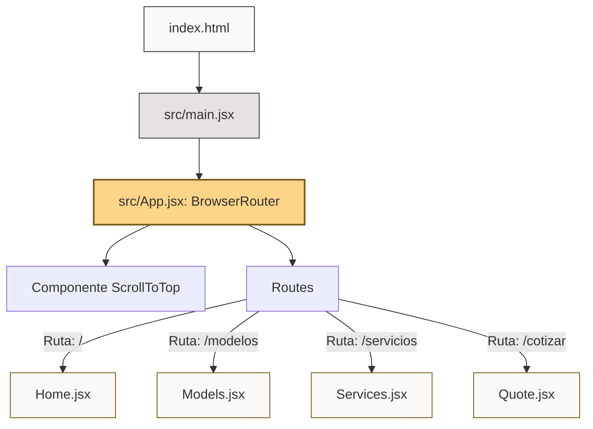

# Documento de Arquitectura - Concesionaria CARLIZ

Este documento proporciona una descripción detallada de la arquitectura de la aplicación **CARLIZ**, un sitio web premium de concesionaria de automóviles de lujo, incluyendo su estructura de directorios, tecnologías utilizadas, y un catálogo completo de sus archivos con la descripción de su funcionamiento y código asociado.

---

## 1. Resumen General del Sistema

El proyecto **CARLIZ** ("Every Second Counts") es un sitio web que actualmente cuenta con una arquitectura híbrida o en transición:
1. **Aplicación Single Page (SPA) en React**: La aplicación moderna que agrupa las páginas interactivas en componentes React, gestionada por **Vite** para la compilación rápida y HMR (Hot Module Replacement), y enrutada mediante **React Router DOM**.
2. **Páginas Estáticas Legadas (HTML/JS vanilla)**: Un conjunto de archivos HTML en la raíz del proyecto que sirvieron como la versión inicial del sitio web y que utilizan Tailwind CSS mediante CDN. Son equivalentes directos de las páginas actuales en React.

El estilo del sitio web está impulsado por **Tailwind CSS v4** en la aplicación React, y por **Tailwind CSS CDN** en las páginas estáticas, logrando una estética visual premium y sofisticada basada en colores oscuros, dorados y grises elegantes, tipografía estilizada y micro-animaciones (como efectos de brillo *shimmer*).

---

## 2. Estructura de Directorios del Proyecto

A continuación se muestra el árbol de directorios del espacio de trabajo:

```text
Website Car_dealership/
├── Cotizaciones.html         # Página estática legada de cotización
├── Modelos.html              # Página estática legada de catálogo (Versión Bento)
├── Modelos2.html             # Página estática legada de catálogo (Versión Lista)
├── README.md                 # Documentación básica por defecto de Vite
├── Servicios.html            # Página estática legada de servicios
├── dist/                     # Directorio de salida para la compilación de producción
├── eslint.config.js          # Configuración de ESLint para la calidad del código
├── index.html                # Entrada principal de la aplicación React (SPA)
├── inicio.html               # Página estática legada de inicio
├── package.json              # Definición de dependencias y scripts del proyecto
├── postcss.config.js         # Configuración de PostCSS (para Tailwind CSS v4)
├── public/                   # Recursos estáticos globales (favicons, etc.)
│   ├── favicon.svg
│   └── icons.svg
├── src/                      # Código fuente de la aplicación React
│   ├── App.css               # Estilos complementarios para App
│   ├── App.jsx               # Enrutador principal de React
│   ├── assets/               # Imágenes y recursos locales
│   │   ├── hero.png
│   │   ├── react.svg
│   │   └── vite.svg
│   ├── index.css             # Importación de Tailwind CSS v4 y temas personalizados
│   ├── main.jsx              # Punto de entrada de renderizado de React
│   └── pages/                # Páginas de la aplicación React
│       ├── Home.jsx          # Página de Inicio
│       ├── Models.jsx        # Catálogo de Modelos
│       ├── Quote.jsx         # Formulario de Cotización
│       └── Services.jsx      # Página de Servicios
├── tailwind.config.js        # Archivo de configuración de Tailwind CSS
└── vite.config.js            # Configuración del empaquetador Vite
```

---

## 3. Arquitectura Técnica y Tecnologías

### Frontend Single Page Application (SPA)
- **Framework Core**: [React 19](https://react.dev/) para la creación de interfaces de usuario basadas en componentes.
- **Enrutamiento**: [React Router DOM v7](https://reactrouter.com/) que permite la navegación fluida sin recargas de página.
- **Compilador / Servidor de Desarrollo**: [Vite v8](https://vite.dev/) que ofrece un entorno ágil con recarga ultra-rápida en desarrollo y optimización avanzada al compilar en producción.
- **Estilos**: **Tailwind CSS v4** integrado vía `@import "tailwindcss";` con **PostCSS** y **Autoprefixer**. Permite extender variables de tema en `@theme` dentro del CSS y utilizar clases de utilidad premium.

### Páginas Estáticas Legadas (HTML)
- **Maquetación**: HTML5 semántico.
- **Estilos**: Tailwind CSS importado a través de su CDN oficial (`https://cdn.tailwindcss.com`) con soporte para plugins como `forms` y `container-queries`.
- **Lógica**: Vanilla JavaScript inline para manejar la interactividad básica (menú lateral móvil, cambios visuales en la barra de navegación al hacer scroll).

---

## 4. Catálogo Detallado de Archivos y Código

### A. Archivos de Configuración del Proyecto

#### 1. [package.json](file:///c:/Users/Antoni/Git-proyectos/Website%20Car_dealership/package.json)
Define las dependencias de Node.js y los scripts del ciclo de vida del proyecto.
- **Scripts principales**:
  - `npm run dev`: Inicia el servidor de desarrollo local mediante `vite`.
  - `npm run build`: Ejecuta `vite build` para empaquetar la aplicación optimizada dentro de `/dist`.
  - `npm run lint`: Analiza el código buscando problemas de calidad con ESLint.
- **Dependencias clave**: React 19, React-DOM 19 y React Router DOM v7.
- **Dependencias de desarrollo**: Tailwind CSS v4, PostCSS, Autoprefixer, ESLint y sus plugins para React.

#### 2. [vite.config.js](file:///c:/Users/Antoni/Git-proyectos/Website%20Car_dealership/vite.config.js)
Configura Vite. Registra el plugin `@vitejs/plugin-react` para permitir el soporte de JSX y la compilación ágil del código de React.

#### 3. [postcss.config.js](file:///c:/Users/Antoni/Git-proyectos/Website%20Car_dealership/postcss.config.js)
Define los procesadores de CSS para la compilación de Tailwind CSS. Utiliza el módulo `@tailwindcss/postcss` y `autoprefixer` para añadir prefijos de compatibilidad de navegadores de forma automática.

#### 4. [tailwind.config.js](file:///c:/Users/Antoni/Git-proyectos/Website%20Car_dealership/tailwind.config.js)
Configura el motor de Tailwind CSS v3/v4 para detectar los archivos de contenido (`index.html` y toda la carpeta `src`). Define los tokens del sistema de diseño como colores personalizados (por ejemplo, `primary` a `#000000`, `secondary` a `#775a19` (dorado premium), grises y tonalidades de superficie), fuentes tipográficas como `Libre Caslon Text` (para títulos elegantes de estilo serif) y `Manrope` (para textos limpios de sans-serif), y espaciados generales.

#### 5. [eslint.config.js](file:///c:/Users/Antoni/Git-proyectos/Website%20Car_dealership/eslint.config.js)
Define reglas de análisis estático del código JavaScript/JSX. Extiende las recomendaciones de `@eslint/js`, reglas para hooks de React (`eslint-plugin-react-hooks`) y políticas de refresco para Vite (`eslint-plugin-react-refresh`). Ignora el directorio de producción `dist/`.

---

### B. Código de Entrada de la SPA

#### 1. [index.html](file:///c:/Users/Antoni/Git-proyectos/Website%20Car_dealership/index.html)
Es el documento HTML de entrada para la SPA de React. Define la cabecera del sitio (metaetiquetas de viewport, título) y la estructura base del DOM con un único contenedor `<div id="root"></div>`. Carga el script modular de inicio `/src/main.jsx`.

#### 2. [src/main.jsx](file:///c:/Users/Antoni/Git-proyectos/Website%20Car_dealership/src/main.jsx)
Arranca y monta la aplicación de React. Utiliza `createRoot` de React DOM para instanciar el árbol de componentes dentro del elemento `#root`. Envuelve al componente principal `<App />` en un `<StrictMode>` para verificar buenas prácticas en desarrollo, e importa los estilos globales de `index.css`.

#### 3. [src/index.css](file:///c:/Users/Antoni/Git-proyectos/Website%20Car_dealership/src/index.css)
Contiene la configuración de estilos de la aplicación:
- Importa Tailwind CSS mediante la directiva `@import "tailwindcss"`.
- Define un tema personalizado de variables CSS con la directiva `@theme` para evitar conflictos en la página de modelos (por ejemplo, fuentes secundarias de `Hanken Grotesk` y colores específicos).
- Configura la tipografía de iconos de Google `Material Symbols Outlined`.
- Define clases de utilidad de diseño exclusivas:
  - `.glass-nav`: Aplica filtros de desenfoque de fondo premium.
  - `.luxury-gradient-text`: Aplica un degradado dorado sobre el texto con clip-path.
  - `.shimmer`: Crea un brillo dinámico reflectante en botones sobre estados `:hover`.
  - `.custom-scrollbar`: Estiliza las barras de desplazamiento internas con colores de la marca.

#### 4. [src/App.jsx](file:///c:/Users/Antoni/Git-proyectos/Website%20Car_dealership/src/App.jsx)
Establece la infraestructura del router mediante React Router DOM.
- Define el componente interno `ScrollToTop`:
  ```jsx
  function ScrollToTop() {
    const { pathname } = useLocation();
    useEffect(() => {
      window.scrollTo(0, 0);
    }, [pathname]);
    return null;
  }
  ```
  Esto asegura que la ventana se desplace al inicio en cada cambio de ruta.
- Define los mapeos de las rutas a sus páginas correspondientes:
  - `/` -> `<Home />`
  - `/modelos` -> `<Models />`
  - `/servicios` -> `<Services />`
  - `/cotizar` -> `<Quote />`

---

### C. Páginas de la Aplicación (React Components)

#### 1. [src/pages/Home.jsx](file:///c:/Users/Antoni/Git-proyectos/Website%20Car_dealership/src/pages/Home.jsx)
Componente funcional que representa la página de aterrizaje de CARLIZ.
- **Características de código**:
  - Estado `isScrolled` para cambiar la altura y opacidad de la barra de navegación fijada cuando el scroll supera los 50 píxeles.
  - Uso de react-router-dom para enlaces internos (`<Link>`) y navegación programática (`useNavigate`).
  - Maquetación de cuadrícula Bento para la sección de "Servicios Distinguidos" con efectos de opacidad y zoom al hacer hover en las tarjetas.
  - Sección de testimonios de clientes con un diseño sofisticado en negro y dorado.

#### 2. [src/pages/Models.jsx](file:///c:/Users/Antoni/Git-proyectos/Website%20Car_dealership/src/pages/Models.jsx)
Componente de catálogo interactivo para el inventario de la concesionaria.
- **Características de código**:
  - Estado `isDrawerOpen` para abrir o cerrar el menú lateral móvil de navegación (*NavigationDrawer*).
  - Barra de filtros horizontal interactiva (Coupé, Sedán, SUV Luxury, Clásicos).
  - Tarjetas de modelos detalladas (`CARLIZ GT SPIRIT V12`, `CARLIZ MONZA EVO`, `CARLIZ HORIZON X`) estructuradas alternadamente (imagen a la izquierda/derecha) que muestran especificaciones detalladas como HP, aceleración de 0 a 100 km/h y transmisiones.

#### 3. [src/pages/Services.jsx](file:///c:/Users/Antoni/Git-proyectos/Website%20Car_dealership/src/pages/Services.jsx)
Muestra los servicios de mantenimiento, repuestos originales y consultoría de financiamiento.
- **Características de código**:
  - Utiliza un `IntersectionObserver` de JavaScript dentro de un hook `useEffect` para detectar cuándo entran los bloques en pantalla y aplicar animaciones suaves de entrada agregando clases dinámicamente (`opacity-100`, `translate-y-0`).
  - Cabecera con imagen tipo parallax de un garaje de lujo y cuadrícula asimétrica de servicios destacados con iconos vectoriales integrados.

#### 4. [src/pages/Quote.jsx](file:///c:/Users/Antoni/Git-proyectos/Website%20Car_dealership/src/pages/Quote.jsx)
Página con el formulario para programar citas y solicitar cotizaciones personalizadas.
- **Características de código**:
  - Estado `formData` que unifica los campos del formulario (`nombre`, `email`, `telefono`, `modelo`, `mensaje`).
  - Estado `submitStatus` para controlar el ciclo de vida del envío del formulario (`idle` -> `processing` -> `success`). Muestra un spinner de carga y un estado de confirmación verde exitoso que se restablece tras 3 segundos.
  - Efecto de parallax sutil sobre la imagen del vehículo de fondo en la sección de medios mediante el cálculo del desplazamiento vertical (`scrollY`).
  - Diseño asimétrico de alto impacto editorial con una tarjeta de datos técnicos flotante sobre el coche de lujo expuesto.

---

### D. Páginas Estáticas Legadas (HTML)

Estas páginas están ubicadas en el directorio raíz. Funcionan como archivos HTML individuales que emulan los componentes React, sirviendo para pruebas estáticas, plantillas iniciales o versiones ligeras:

- [inicio.html](file:///c:/Users/Antoni/Git-proyectos/Website%20Car_dealership/inicio.html): Equivalente estático de `Home.jsx`. Posee el mismo diseño visual, hero image, rejilla Bento y código JS vanilla inline al pie para el scroll de la navbar.
- [Modelos2.html](file:///c:/Users/Antoni/Git-proyectos/Website%20Car_dealership/Modelos2.html): Equivalente estático directo de `Models.jsx`. Incluye la lógica vanilla JS para abrir y cerrar el NavigationDrawer móvil (`toggleDrawer`) y el listado de vehículos.
- [Modelos.html](file:///c:/Users/Antoni/Git-proyectos/Website%20Car_dealership/Modelos.html): Una versión alternativa previa al catálogo de modelos estructurada en una cuadrícula de tipo Bento (Vanguard GT-R, Horizon X7, Executive S5, etc.) con filtros dinámicos basados en clases JS básicas.
- [Servicios.html](file:///c:/Users/Antoni/Git-proyectos/Website%20Car_dealership/Servicios.html): Equivalente estático de `Services.jsx`. Presenta las secciones de mantenimiento, repuestos y asesoría con efectos visuales sencillos.
- [Cotizaciones.html](file:///c:/Users/Antoni/Git-proyectos/Website%20Car_dealership/Cotizaciones.html): Equivalente estático de `Quote.jsx`. Contiene el formulario HTML con validación simple de campos y la imagen con la tarjeta informativa lateral.

---

## 5. Mapeo de Correspondencia (Migración)

Para facilitar el mantenimiento y la evolución del sitio, a continuación se detalla la correlación entre la versión de páginas estáticas inicial y los componentes React modernos de la SPA:

| Página Estática (Legado en Raíz) | Componente React (Moderno en `src/pages/`) | Ruta Asociada en SPA | Propósito / Funcionalidad Principal |
| :--- | :--- | :--- | :--- |
| [inicio.html](file:///c:/Users/Antoni/Git-proyectos/Website%20Car_dealership/inicio.html) | [Home.jsx](file:///c:/Users/Antoni/Git-proyectos/Website%20Car_dealership/src/pages/Home.jsx) | `/` | Portada, Bento Grid de servicios y testimonios |
| [Modelos2.html](file:///c:/Users/Antoni/Git-proyectos/Website%20Car_dealership/Modelos2.html) | [Models.jsx](file:///c:/Users/Antoni/Git-proyectos/Website%20Car_dealership/src/pages/Models.jsx) | `/modelos` | Catálogo de inventario con especificaciones detalladas |
| [Servicios.html](file:///c:/Users/Antoni/Git-proyectos/Website%20Car_dealership/Servicios.html) | [Services.jsx](file:///c:/Users/Antoni/Git-proyectos/Website%20Car_dealership/src/pages/Services.jsx) | `/servicios` | Sección descriptiva de servicios de élite e instalaciones |
| [Cotizaciones.html](file:///c:/Users/Antoni/Git-proyectos/Website%20Car_dealership/Cotizaciones.html) | [Quote.jsx](file:///c:/Users/Antoni/Git-proyectos/Website%20Car_dealership/src/pages/Quote.jsx) | `/cotizar` | Formulario asimétrico con control de envío y datos técnicos |
| [Modelos.html](file:///c:/Users/Antoni/Git-proyectos/Website%20Car_dealership/Modelos.html) | *N/A (Diseño Bento antiguo)* | *N/A* | Variante antigua del catálogo en cuadrícula Bento |

---

## 6. Flujo de Datos y Navegación en la SPA



1. El navegador carga [index.html](file:///c:/Users/Antoni/Git-proyectos/Website%20Car_dealership/index.html) y arranca [main.jsx](file:///c:/Users/Antoni/Git-proyectos/Website%20Car_dealership/src/main.jsx).
2. Se renderiza el componente [App.jsx](file:///c:/Users/Antoni/Git-proyectos/Website%20Car_dealership/src/App.jsx) que envuelve las rutas con un `BrowserRouter`.
3. El componente auxiliar `ScrollToTop` intercepta cada cambio de localización (`useLocation()`) y ejecuta `window.scrollTo(0, 0)` para mantener una experiencia de navegación natural.
4. El enrutador renderiza el componente correspondiente a la URL activa, utilizando Tailwind CSS v4 para aplicar los estilos definidos de forma reactiva y rápida.
